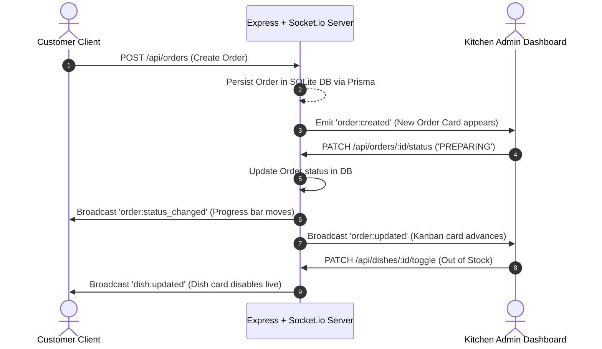

# 🏗️ NutriCraft Technical Architecture Document

This document details the architectural principles, data flow models, state management strategies, and WebSockets real-time protocol powering **NutriCraft**.

---

## 1. High-Level Component Architecture

```text
+-----------------------------------------------------------------------------------+
|                                 CLIENT LAYER                                      |
|                                                                                   |
|   +-----------------------+   +-----------------------+   +-------------------+   |
|   |   Customer Menu UI    |   | Custom Meal Builder   |   | Subscription Cal  |   |
|   +-----------------------+   +-----------------------+   +-------------------+   |
|   |  Live Tracker Canvas  |   |  Kitchen Kanban Board |   | Prep Forecast UI  |   |
|   +-----------------------+   +-----------------------+   +-------------------+   |
|                                                                                   |
|                    React 18 + TypeScript + Tailwind CSS                           |
+-----------------------------------------+-----------------------------------------+
                                          |
                        HTTP REST / WebSockets (Socket.io)
                                          |
+-----------------------------------------v-----------------------------------------+
|                                 SERVER LAYER                                      |
|                                                                                   |
|   +-----------------------+   +-----------------------+   +-------------------+   |
|   | Express REST Services |   | Socket.io Room Server |   | Macro Calc Engine |   |
|   +-----------------------+   +-----------------------+   +-------------------+   |
|                                                                                   |
|                         Node.js + Express + TypeScript                            |
+-----------------------------------------+-----------------------------------------+
                                          |
                                     Prisma ORM
                                          |
+-----------------------------------------v-----------------------------------------+
|                                DATABASE LAYER                                     |
|                                                                                   |
|   +---------------+   +-------------------+   +----------+   +----------------+   |
|   |  Dish Table   |   | CustomizationOpt  |   | Orders   |   | Subscriptions  |   |
|   +---------------+   +-------------------+   +----------+   +----------------+   |
|                                                                                   |
|                                Relational SQLite                                  |
+-----------------------------------------------------------------------------------+
```

---

## 2. Real-Time WebSockets Sync Protocol

NutriCraft leverages **Socket.io** for real-time bidirectional communication between customer clients and the kitchen administration system.

### WebSocket Events Spectrum:



---

## 3. Data Schema & Models (Prisma ORM)

```prisma
model Dish {
  id           String   @id @default(uuid())
  name         String
  description  String
  category     String   // High Protein, Low Carb, Balanced
  cuisine      String   // North Indian, South Indian, East Indian, West Indian
  dietary      String   // Veg, Non-Veg, Vegan
  basePrice    Float
  baseCalories Int
  baseProtein  Float
  baseCarbs    Float
  baseFats     Float
  imageUrl     String
  isAvailable  Boolean  @default(true)
  createdAt    DateTime @default(now())
}

model CustomizationOption {
  id            String  @id @default(uuid())
  category      String  // BASE_CARB, EXTRA_PROTEIN, OIL_GHEE
  optionName    String
  extraPrice    Float   @default(0)
  extraCalories Int     @default(0)
  extraProtein  Float   @default(0)
  extraCarbs    Float   @default(0)
  extraFats     Float   @default(0)
}

model Order {
  id                     String      @id @default(uuid())
  orderNumber            String      @unique
  customerName           String
  customerPhone          String
  address                String
  deliverySlot           String
  totalPrice             Float
  totalCalories          Int
  totalProtein           Float
  totalCarbs             Float
  totalFats              Float
  status                 String      @default("PLACED")
  isSubscriptionDelivery Boolean     @default(false)
  createdAt              DateTime    @default(now())
  updatedAt              DateTime    @updatedAt
  items                  OrderItem[]
}

model Subscription {
  id           String   @id @default(uuid())
  userName     String
  userPhone    String
  userAddress  String
  planType     String   // 1x_MEAL_DAILY, 2x_MEAL_DAILY
  activeDays   String   // MON_FRI, MON_SAT, ALL_DAYS
  deliverySlot String
  startDate    String
  endDate      String
  pausedDates  String   @default("[]") // JSON string of dates YYYY-MM-DD
  status       String   @default("ACTIVE")
  monthlyPrice Float
  createdAt    DateTime @default(now())
}
```

---

## 4. Macro Calculation Mathematical Logic

For any meal with base parameters $(P_b, C_b, F_b, K_b, \text{Price}_b)$ and chosen customizations $(i \in \text{Carbs}, j \in \text{Protein}, k \in \text{Fat})$, the total nutritional breakdown is calculated deterministically:

$$\text{Calories}_{\text{total}} = K_b + \Delta K_i + \Delta K_j + \Delta K_k$$

$$\text{Protein}_{\text{total}} = P_b + \Delta P_i + \Delta P_j + \Delta P_k$$

$$\text{Carbs}_{\text{total}} = C_b + \Delta C_i + \Delta C_j + \Delta C_k$$

$$\text{Fats}_{\text{total}} = F_b + \Delta F_i + \Delta F_j + \Delta F_k$$

$$\text{Price}_{\text{total}} = \text{Price}_b + \Delta \text{Price}_i + \Delta \text{Price}_j + \Delta \text{Price}_k$$

### Energy Distribution Percentages:
$$\text{Protein Kcal} = \text{Protein}_{\text{total}} \times 4$$
$$\text{Carbs Kcal} = \text{Carbs}_{\text{total}} \times 4$$
$$\text{Fats Kcal} = \text{Fats}_{\text{total}} \times 9$$
$$\text{Total Kcal}_{\text{calc}} = \text{Protein Kcal} + \text{Carbs Kcal} + \text{Fats Kcal}$$

$$\text{Protein } \% = \left( \frac{\text{Protein Kcal}}{\text{Total Kcal}_{\text{calc}}} \right) \times 100$$
