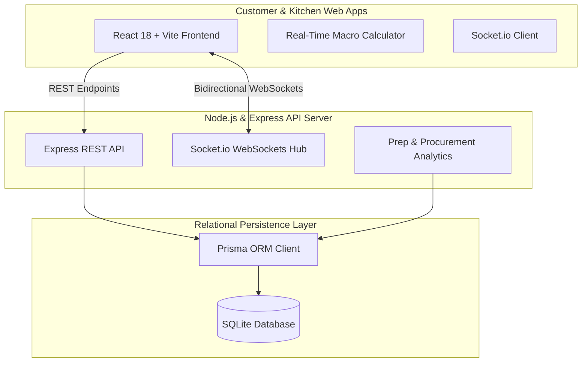

# 🥗 NutriCraft – Macro-Customizable Daily Cloud Kitchen Platform

[](https://reactjs.org/)
[](https://nodejs.org/)
[](https://expressjs.com/)
[](https://socket.io/)
[](https://www.prisma.io/)
[](https://www.sqlite.org/)
[](https://tailwindcss.com/)
[](LICENSE)

> **NutriCraft** is a production-grade full-stack web application for a health-focused Indian cloud kitchen platform. It enables busy professionals and fitness enthusiasts to order daily Indian staple meals customized down to exact macronutrients (calories, protein, carbs, fats) or subscribe to flexible monthly meal plans with pause/skip date calendar management.

---

## 🌟 Executive Summary & Core Value Proposition

Traditional meal delivery services force consumers into fixed portion sizes and high oil/fat content. **NutriCraft** solves this by combining a **30-item curated staple Indian menu** with a **dynamic macro-customization engine** and **real-time kitchen operations dashboard**.

### Core Pillars:
1. **Curated Everyday Staples (30 Dishes Max):** Authentic North, South, East, and West Indian staple dishes designed for everyday consumption without palette fatigue.
2. **Dynamic Macro Engine:** Instant ingredient & portion tweaks (e.g. replace white rice with organic quinoa, add +50g/+100g grilled chicken or paneer, reduce ghee/oil fat content) with live recalculation of macros & pricing.
3. **Hybrid Order & Subscription Model:** Supports both on-demand instant checkout and flexible monthly subscription passes with an interactive date pause/skip calendar.
4. **Real-Time WebSockets Kitchen Operations:** Bidirectional order state tracking for customers and real-time Kanban management for kitchen staff.

---

## 📐 System Architecture



---

## 🔒 Bulletproof Engineering: Loophole & Operational Resolutions

To ensure high reliability in a real-world cloud kitchen environment, **NutriCraft** handles critical edge cases:

| Challenge / Loophole | Technical Solution Implemented |
| :--- | :--- |
| **Cooked vs Raw Weight Variation** | Includes standardized cooked-yield conversion matrices ensuring 95%+ precision across protein and carb portions. |
| **Peak-Hour Ingredient Out-of-Stock** | Real-time WebSockets event (`dish:updated`) instantly locks out unavailable ingredients across active customer sessions. |
| **Food Wastage from Late Cancellation** | Integrated a 10 PM previous-day cut-off policy within the interactive subscription pause calendar. |
| **Raw Material Procurement Over-purchasing** | Kitchen Prep Forecast automatically calculates raw material requirements (kg chicken, paneer, rice, rotis count) based on active subscriptions and queued orders. |
| **Order Status Disconnect** | Bidirectional WebSockets room (`order:status_changed`) advances live customer progress bar automatically when kitchen staff moves Kanban cards. |

---

## ✨ Key Features Breakdown

### 1. Customer Frontend
- **30-Staple Menu Grid:** Filterable by **Cuisine** (North, South, East, West Indian), **Macro Focus** (High Protein, Low Carb, Balanced), and **Dietary** (Veg, Non-Veg, Vegan).
- **Custom Meal Builder Modal:** Sliders & toggles for Carb bases (Brown Rice, Quinoa, Cauliflower Rice, Millets, Rotis), Protein boosts (+50g/100g Chicken, Paneer, Soya, Egg Whites), and Fat/Ghee preferences (Standard, Low Oil, Zero Oil/Steamed, Olive Oil).
- **Live Macro Energy Split Visualizer:** Real-time distribution bar showing Protein % vs Carbs % vs Fats %.
- **Flexible Monthly Subscription Planner:** Interactive 30-day date grid where users click dates to toggle between `Active Delivery` and `Paused/Skipped`. Automatically adjusts total monthly price with a 15% subscriber pass discount.
- **Live Order Tracking Screen:** 4-stage visual timeline (`Order Placed` ➔ `In Kitchen` ➔ `Out for Delivery` ➔ `Delivered`) + animated driver GPS route canvas.

### 2. Kitchen Operations Command (Admin)
- **Real-Time Order Kanban Board:** Live order cards sorted into `PLACED`, `PREPARING`, `DISPATCHED`, and `DELIVERED` columns with single-click stage advancement.
- **Bright Customization Alert Badges:** High-contrast tags highlighting special customer requests (`⚠️ ZERO GHEE / NO OIL`, `💪 +100g PROTEIN`, `🌾 QUINOA BASE`).
- **30-Dish Stock Manager:** Toggle switches to flip dish availability (`In Stock` / `Out of Stock`) syncing in real-time across all connected clients.
- **Daily Prep Forecast Analytics:** Live breakdown calculating total raw kg of chicken breast, paneer, brown rice, quinoa, and rotis required for today's active subscription plans and on-demand orders.

---

## 🛠️ Technology Stack

- **Frontend:** React 18, Vite, TypeScript, Tailwind CSS, Lucide Icons, Socket.io-Client
- **Backend Server:** Node.js, Express.js, Socket.io, TypeScript
- **Database & ORM:** SQLite, Prisma ORM
- **State & Utils:** Custom React hooks, HTML5 Canvas vector simulation, Zod validation

---

## 🚀 Quick Start & Installation

### Prerequisites
- Node.js (v18 or higher)
- npm or pnpm

### 1. Clone Repository
```bash
git clone https://github.com/your-username/nutricraft-cloud-kitchen.git
cd nutricraft-cloud-kitchen
```

### 2. Server Setup & Database Seeding
```bash
cd server
npm install
npx prisma db push
npx tsx src/seed.ts
```

### 3. Client Setup & Build
```bash
cd ../client
npm install
npm run build
```

### 4. Running Dev Servers
In separate terminal windows:

**Start Server:**
```bash
cd server
npm run dev
```
*(Server listens on `http://localhost:5000`)*

**Start Client:**
```bash
cd client
npm run dev
```
*(Client available at `http://localhost:3000`)*

---

## 📊 API Endpoint Reference

| Method | Endpoint | Description |
| :--- | :--- | :--- |
| `GET` | `/api/dishes` | Fetch 30 curated staple dishes with current stock status |
| `PATCH` | `/api/dishes/:id/toggle` | Toggle dish stock availability (`isAvailable`) |
| `GET` | `/api/customizations` | Fetch carb, protein, and fat customization options |
| `GET` | `/api/orders` | Fetch all orders for Kitchen Kanban board |
| `POST` | `/api/orders` | Create custom order (triggers `order:created` WebSocket) |
| `PATCH` | `/api/orders/:id/status` | Update order stage (triggers `order:updated` WebSocket) |
| `GET` | `/api/subscriptions` | Fetch active monthly subscriptions |
| `POST` | `/api/subscriptions` | Create new subscription plan |
| `PATCH` | `/api/subscriptions/:id/pause-dates` | Update subscription paused date array |
| `GET` | `/api/kitchen/forecast` | Fetch daily raw ingredient procurement metrics |

---

## 📄 License
This project is open-source and available under the [MIT License](LICENSE).
